# Few and Zero Shot Learning

!!! danger

    This is work in progress. The contents of this page are not final and, therefore, it is not recommended to start working on its contents yet.

The following contents are copied (and slighly adapted) to the AI master from the [ISMIR 2022 tutorial](https://github.com/music-fsl-zsl/tutorial) created by Yu Wang, Hugo Flores García, and Jeong Choi. This is shared under [Creative Commons BY-NC-SA 4.0](https://github.com/music-fsl-zsl/tutorial/blob/main/LICENSE).

## What is Few-Shot Learning (FSL) and Zero-Shot Learning (ZSL)?

Before we dive right into FSL and ZSL, we would like to start with a brief discussion about the labeled data scarcity problem to illustrate the motivation and relevance of few-shot and zero-shot learning.  

Deep learning has been highly successful in data-intensive applications, but is often hampered when the dataset is small. A deep model that generalizes well typically needs to be trained on a large amount of labeled data. However, in some applications such as music, most datasets are small in size compared to datasets in other domains, such as image and text. This is not only because collecting musical data may be riddled with copyright issues, but annotating musical data can also be very costly. The annotation process often requires expert knowledge and takes a long time as we need to listen to audio recordings multiple times. Therefore, many current music studies are built upon relatively small datasets with less-than-ideal model generalizability. Researchers have been studying strategies to tackle this scarcity issue for labeled data. These strategies can be roughly summarized into two categories:

- **Data**: crowdsourcing, data augmentation, data synthesis, etc.
- **Learning Paradigm**: transfer learning, semi-supervised learning , etc.

However, there are different challenges for each of these approaches. For example, crowdsourcing still requires a large amount of human effort with potential label noise, the diversity gain from data augmentation is limited, and models trained on synthetic data might have issues generalizing to real-world data.

Even with the help of transfer learning or unsupervised learning, we often still need a significant amount of labeled data (e.g. hundreds of thousands of examples) for the target downstream tasks, which could still be hard for rare classes. 

Few-shot learning (FSL) and zero-shot learning (ZSL), on the other hand, tackle the labeled data scarcity issue from a different angle. They are learning paradigms that aim to learn a model that can learn a new concept (e.g. recognize a new class) quickly, based on just *a handful of labeled examples* (few-shot) or some *side information or metadata* (zero-shot). 

#### An example

To have a better idea of how FSL and ZSL differ from standard supervised learning, let's consider an example of training a musical instrument classifier. We assume that there is an existing dataset in which we have abundant labeled examples for common instruments.

- In a standard supervised learning scenario, we train the classification model on the training set `(guitar, piano)`, then at test time, the model classifies *"new examples"* of *"seen classes"* `(guitar, piano)`.
- In a few-shot learning scenario, we also train the model with the same training set that is available `(guitar, piano)`. But at test time, the goal is for the few-shot model to recognize new examples from **unseen classes** (like `(banjo, kazoo)`) by providing a **very small amount** of labeled examples.  
- In a zero-shot learning scenario, we train the model on the available training set `(guitar, piano)`. But at test time, the goal is for the zero-shot model to recognize new examples from **unseen classes** (like `(banjo, kazoo)`) by providing **some side information or metadata** (e.g. the instrument family, e.g. string, wind, percussion, etc.) or a text embedding.

## Few-Shot Learning Foundations

It should come with no surprise that data is at the core of few-shot learning problems. This chapter covers the foundations of few-shot learning – namely how we think about and structure our data – when trying to learn novel, unseen classes with very little labeled data.

When solving traditional classification problems, we typically consider a closed set of classes. That is, we expect to see the same set of classes during inference as we did during training. Few-shot learning breaks that assumption and instead expects that the classification model will encounter novel classes during inference. There is one caveat: there are a **few labeled examples** for each novel class at inference time. 

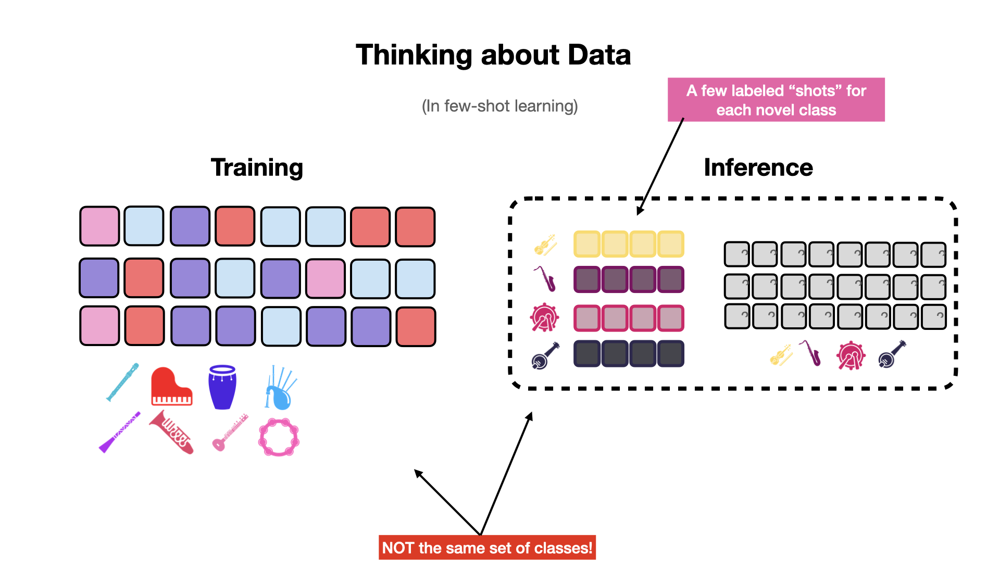

In few-shot learning, we expect to see **novel** classes at inference time. We also expect to see a few labeled examples (a.k.a. "shots") for each of the novel classes. 

> Transfer learning and data augmentation are often considered approaches to few-shot learning [@song2022comprehensive], since both of these approaches are used to learn new tasks with limited data. However, we believe these approaches are extensive and deserve their own treatment, and so we will not cover them here. Instead, we will focus on the topic of **meta-learning** – or learning to learn – which is at the heart of recent advances for few-shot learning. Transfer learning and data augmentation are orthogonal to meta-learning and can be used in conjunction with meta-learning approaches.

### Defining the Problem

Consider that we would like to classify between \(K\) classes, and we have exactly \(N\) labeled examples for each of those classes. We say that few-shot models are trained to solve a \(K\)-way, \(N\)-Shot classification task. 

> A few-shot learning problem splits data into two separate sets: the support set (the few labeled examples of novel data) and the query set (the data we want to label).

Few shot learning tasks divide the few labeled data we have and the many unlabeled data we would like to to label into two separate subsets: the **support set** and the **query set**. 

The small set of labeled examples we are given at inference time is the **support set**. The support set is small in size and contains a few (\(N\)) examples for each of the classes we would like to consider. The purpose of the support set is to provide some form of guidance to help the model learn and adapt to the novel classification task. 

Formally, we define the support set as a set of labeled training pairs \(S = \{(x_1, y_1,), (x_2, y_2), ..., (x_N, y_N)\}\), where:

- \(x_i \in \mathbb{R}^D\) is a \(D\)-dimensional input vector.
- \(y_i \in \{1,...,C\}\) is the class label that corresponds to \(x_i\).
- \(S_k\) refers to the set of examples with label \(K\).
- \(N\) is the size of the support set, where \(N = C \times K\).  

On the other hand, the query set – typically denoted as \(Q\) – contains all of the examples we would like to label. We can compare the model's predictions on the query set to the true labels (i.e., ground truth) to compute the loss used for training the model. In evaluation, we can use these predictions to compute metrics such as accuracy, precision, and recall.

#### The Goal

The goal of few-shot learning algorithms is to learn a classification model \(f_\theta\) that is able to generalize to a set of \(K\) previously unseen classes at inference time, with a small support set of \(N\) examples for each previously unseen class.

### Meta Learning - Learning to Learn

In order for a classifier to be able to learn a novel class with only a few labeled examples, we can employ a technique known as **meta learning**, or learning to learn.

> Even though our goal in few shot learning is to be able to learn novel classes with very few labeled examples, we *still* require a sizable training dataset with thousands of examples. The idea is that we can *learn how to learn new classes* from this large training set, and then apply that knowledge to learn novel classes with very few labeled examples.

#### Class-conditional splits

In supervised learning, one typically creates a train/test split in the dataset while ensuring that the classes seen during training are the same as those seen during testing.

In few-shot learning, because we'd like our model to generalize to novel classes at inference time, we must make sure that there is no overlap between classes in our train, and test sets.

A train/test split with no overlap between classes is called a **class-conditional** split. 

#### Episodic Training

To take full advantage of a large training set for few-shot learning, we use a technique referred to as **episodic training** {cite}`vinyals2016matching, ravi2017optimization`. 

> Episodic training is an efficient way of leveraging a large training dataset to train a few-shot learning model.

Episodic training aims to split each training iteration into it's own self-contained learning task. An episode is like a simulation of a few-shot learning scenario, typically with \(K\) classes and \(N\) labeled examples for each class -- similar to what we expect the model to be able to infer at inference time. 

During episodic training, our model will see a completely new \(N\)-shot, \(K\)-way classification task at each step. To build a single episode, we must sample a completely new support set and query set during each training step. 

Practically, this means that for each episode, we have to choose a subset of \(K\) classes from our training dataset and then sample \(N\) labeled examples (for the support set) and \(q\) examples (for the query set) for each class that we randomly sampled. 

### Evaluating a Few-Shot Model

Validation and Evaluation during episodic training can be done in a similar fashion to training. We can build a series of episodes from our validation and evaluation datasets, and then evaluate the model on each episode using standard classifcation metrics, like [precision, accuracy, F-score,](https://developers.google.com/machine-learning/crash-course/classification/precision-and-recall) and [AUC](https://developers.google.com/machine-learning/crash-course/classification/roc-and-auc). 

<!---We've now covered the basic foundations of few-shot learning. Next, we'll look at some of the most common approaches to few-shot learning, namely **metric**-based, **optimization**-based, and **memory**-based approaches. 
--->
-------------------------

## Few-Shot Learning approaches

Now that we have a grasp of the foundations of few-shot learning,  we'll take a look at some of the most common approaches to the solving few-shot problems. 

<!--
Recall that the goal of few-shot learning is to be able to learn to solve a new machine learning task given only a few labeled examples. In few-shot learning problems, we are given a small set of labeled examples for each class we would like to predict (the support set), as well as a larger set of unlabeled examples (the query set). We tend to refer to few-shot learning tasks as \(K\)-way, \(N\)-shot classification tasks, where \(K\) is the number of classes we would like to predict, and \(N\) is the number of labeled examples we are given for each class. 
-->

When training a model to solve a few-shot learning task, we typically sample episodes from a large training dataset. An episode is a simulation of a few-shot learning task, where we sample \(K\) classes and \(N\) labeled examples for each class. As we have seen, training a deep model by sampling few-shot learning episodes from a large training dataset is known as **episodic training**.

Here are the few-shot learning approaches covered in this document:

1. **Metric-based few-shot learning**

2. **Optimization-based few-shot learning**

### Metric-Based Few-Shot Learning

Metric-based approaches to few-shot learning are able to learn an embedding space where examples that belong to the same class are close together according to some **metric**, even if the examples belong to classes that were not seen during training. 

<!-- Episodic training is essential to making metric-based few-shot models succeed in practice. Without episodic training, training a model using only $K$ examples for each class would result in poor generalization, and the model would not be able to generalize to new classes.  -->

At the center of metric-based few-shot learning approches is a similarity _metric_, which we will refer to as \(g_{sim}\). We use this similarity metric to compare how similar examples in the query set are to examples in the support set. After knowing how similar a query example is to each example in the support set, we can infer to which class in the support set the query example belongs to. Note that this is conceptually the same as performing a [nearest neighbor search](https://en.wikipedia.org/wiki/Nearest_neighbor_search). 

This similarity comparison is typically done in the embedding space of some neural net model, which we will refer to as \(f_\theta\). Thus, during episodic training, we train \(f_\theta\) to learn an embedding space where examples that belong to the same class are close together, and examples that belong to different classes are far apart. This embedding model is sometimes also referred to as a _backbone_ model.

There are many different metric-based approaches to few-shot learning, and they all differ in how they define the similarity metric \(g_{sim}\), and how they use it to compare query examples to support examples as well as formulate a training objective.

Among the most popular metric-based approaches are Prototypical Networks {cite}`snell2017prototypical`, Matching Networks {cite}`vinyals2016matching`, and Relation Networks {cite}`sung2018relation`.

##### Example: Prototypical networks

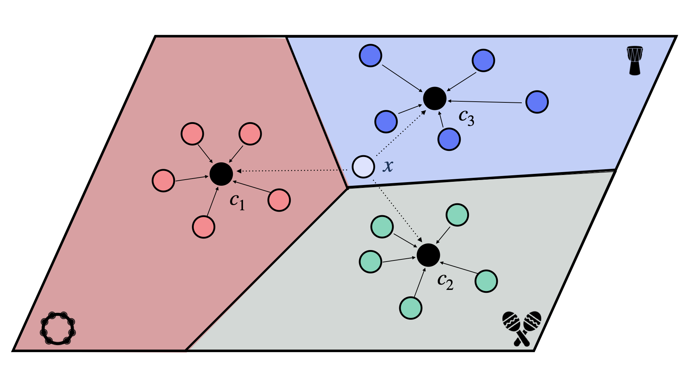

The figure above illustrates a 5-shot, 3-way classification task between tambourine (red), maracas (green), and djembe (blue). In prototypical networks, each of the 5 support vectors are averaged to create a prototype for each class (\(c_k\)). The query vector \(x\) is compared against each of the prototypes using squared euclidean distance. The query vector (shown as \(x\)) is assigned to the class of the prototype that it is most similar to. Here, the prototypes \(c_k\) are shown as black circles. 

> Prototypical networks {cite}`snell2017prototypical` work by creating a single embedding vector  for each class in the support set, called the **prototype**. The prototype for a class is the mean of the embeddings of all the examples in the support set for that class. 

> Although not mentioned explicitly in the paper, [Siamese Neural Networks](https://www.cs.cmu.edu/~rsalakhu/papers/oneshot1.pdf) is a kind of metric learning predecessor for prototypical networks as well. Siamese networks embed all support objects and the query object into a latent space and do a pairwise comparison between the query and all other support objects. The label of the closest support object is assigned to the query. Prototypical networks improve by 1) requiring comparisons between query and support centroids, not individual samples, during inference and 2) suffering from less sample noise by taking the mean of support embeddings.

The prototype (denoted as \(c_k\)) for a class \(k\) is defined as: 

$$c_k = \frac{1}{|S_k|} \sum_{x_k \in S_k} f_\theta(x_k)$$

where \(S_k\) is the set of all examples in the support set that belong to class \(k\), \(x_k\) is an example in \(S_k\), and \(f_\theta\) is the backbone model we are trying to learn. 

After creating a prototype for each class in the support set, we use the euclidean distance between the query example and each prototype to determine which class the query example belongs to. We can build a probability distribution over the classes by applying a softmax function to the negated distances between a given query example and each prototype:

$$p(y = k | x_q) = \frac{exp(-d(x_q, c_k))}{\sum_{k'} exp(-d(x_q, c_{k'}))}$$

where \(x_q\) is a query example, \(c_k\) is the prototype for class \(k\), and \(d\) is the squared euclidean distance between two vectors.

<!---
## Prototypical Networks are Zero-Shot Learners too!

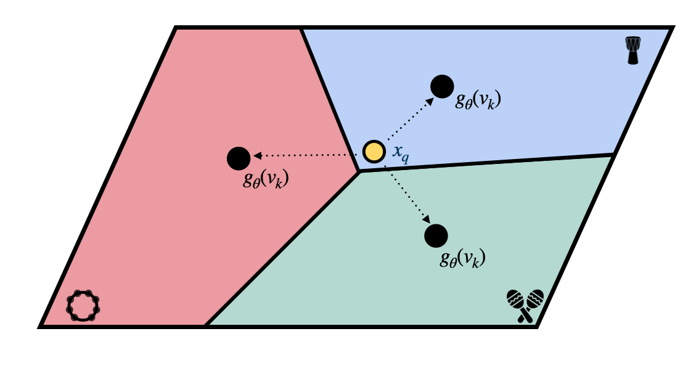

When used for zero-shot learning (ZSL), prototypical networks don't require a labeled support set of examples for each class. Instead, the model is trained using a set of class metadata vectors, which are vectors that describe the characteristics of each class that the model should be able to classify. These metadata vectors are mapped to the same embedding space as the inputs using a separate model, \(g_\theta\), and used as the prototypes for each class. The prototypical network then uses the distances between the input and the class prototypes to make predictions about the input's category.

The prototypical network method can also be used for zero-shot learning. The method remains mostly the same as above. 
However, instead of relying on a support set \(S_k\) for each class \(k\), we are given some class metadata vector \(v_k\) for each class. 

The class metadata vector \(v_k\) is a vector that contains some information about the class \(k\), which could be in the form of a text description of the class, an image, or any other form of data.  During training, we learn a mapping \(g_\theta\) from the class metadata vector \(v_k\) to the prototype vector \(c_k\): \(c_k = g_\theta(v_k)\).

In this zero-shot learning scenario, we are mapping from two different domains: the domain of the class metadata vectors \(v_k\) (ex: text) and the domain of the query examples \(x_q\) (ex: audio). 

This means that we are learning two different backbone models that map to the **same embedding space**: \(f_\theta\) for the input query and \(g_\theta\) for the class metadata vectors.
--->

### Optimization-Based Few-Shot Learning 

Optimization-based approaches focus on learning model parameters \(\theta\) that can easily adapt to new tasks, and thus new classes. The canonical method for optimization-based few-shot learning is Model-Agnostic Meta Learning (MAML) {cite}`finn2017model`,
and it's successors {cite}`li2017meta, sun2019mtl`. 

The intuition behind MAML is that some representations are more easily transferrable to new tasks than others. 

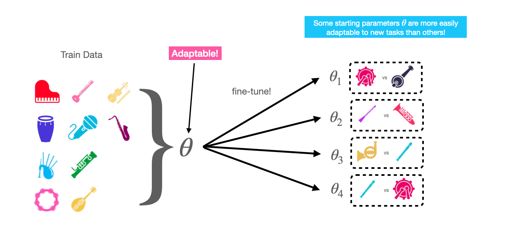

For example, assume we train a model with parameters \(\theta\) to classify between (`piano`, `guitar`, `saxophone` and `bagpipe`) samples. 
Normally, we would expect that these parameters \(\theta\) would not be useful for classifying between instruments outside the training distribution, like `cello` and `flute`. The goal of MAML is to be able to learn parameters \(\theta\) that are useful not just for classifying between the instruments in the training set, but also are easy to adapt to new instrument classification tasks given a support set for each task, like `cello` vs `flute`, `violin` vs `trumpet`, etc.

In other words, if we have some model parameters \(\theta\), we want \(\theta\) to be adapted to new tasks using only a few labeled examples (a single support set) in a few gradient steps. 

The MAML algorithm accomplishes this by training the model to adapt from a starting set of parameters \(\theta\) to a new set of parameters \(\theta_i\) that are useful for a particular episode \(E_i\). This is performed for all episodes in a batch, eventually learning a starting set of parameters \(\theta\) that can be successfully adapted to new tasks using only a few labeled examples.

Note that MAML makes no assumption of the model architecture, thus the "model-agnostic" part of the method.

#### The MAML algorithm

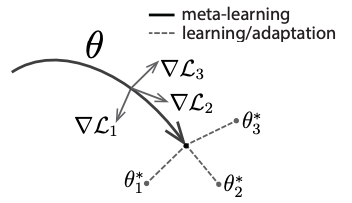

> The MAML algorithm {cite}`finn2017model`. The starting model parameters are depcted as \(\theta\), while the task-specific, fine-tuned parameters for tasks 1, 2, and 3 are depicted as \(\theta_1^*\), \(\theta_2^*\), and \(\theta_3^*\), respectively. 

Suppose we are given a meta-training set composed of many few-shot episodes \(D_{train} = \{E_1, E_2, ..., E_n\}\), where each episode contains a support set and train set \(E_i = (S_i, Q_i)\). We can follow the MAML algorithm to learn parameters \(\theta\) that can be adapted to new tasks using only a few examples and a few gradient steps. 

Overview of the MAML algorithm {cite}`finn2017model`:

-------

* Initialize model parameters \(\theta\) randomly, choose step sizes \(\alpha\) and \(\beta\).  
* **while** not converged **do**
    * Sample a batch of episodes (tasks) from the training set \(D_{train} = \{E_1, E_2, ..., E_n\}\)
    * **for** each episode \(E_i\) in the batch **do**
        *  Using the current parameters \(\theta\), compute the gradient of the loss \(L_if(\theta)\) for episode \(E_i\).
        * Compute a new set of parameters \(\theta_i\) by fine-tuning in the direction of the gradient w.r.t. the starting parameters \(\theta\): 
        $$\theta_i = \theta - \alpha \nabla_{\theta} L_i$$
    * Using the fine-tuned parameters \(\theta_i\) for each episode, make a prediction and compute the loss \(L_{i}f(\theta_i)\).
    * Update the starting parameters \(\theta\) by taking a gradient step in the direction of the loss we computed with the fine-tuned parameters \(L_{i}f(\theta_i)\):
        $$\theta = \theta - \beta \nabla_{\theta} \sum_{E_i \in D_{train}}L_i f(\theta_i)$$

-------

At inference time, we are given a few-shot learning task with support and query set \(E_{test} = (S_{test}, Q_{test})\). We can use the learned parameters \(\theta\) as a starting point, and follow a process similar to the one above to make a prediction for the query set \(Q_{test}\):  

-------

1. Initialize model parameters \(\theta\) to the learned parameters from meta-training.
2. Compute the gradient \(\nabla_{\theta} L_{test} f(\theta)\) of the loss \(L_{test}f(\theta)\) for the test episode \(E_{test}\).
3. Similar to step 6 of the training algorithm above, compute a new set of parameters \(\theta_{test}\) by fine-tuning in the direction of the gradient w.r.t. the starting parameters \(\theta\). 
4. Make a prediction using the fine-tuned parameters \(\theta_{test}\): \(\hat{y} =(\theta_{test})\).

-------

## Zero-Shot Learning Foundations

Zero-shot learning (ZSL) is yet another approach for classifying the classes that are not observed during training. Main difference from few-shot learning is that it does not require any additional label data for novel class inputs. 

Therefore, in zero-shot learning, there is no further training step for unseen classes. Instead, during the training phase, the model learns how to use the side information that can potentially cover the relationship between any of both seen and unseen classes. After training, it can handle the cases where inputs from unseen classes are to be classified.

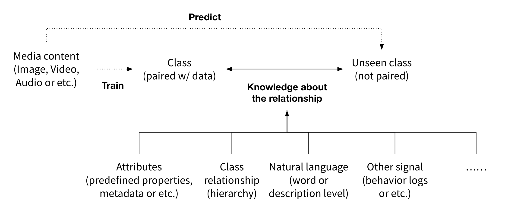

ZSL was originally inspired by human’s ability to infer novel objects or create new categories dynamically based on prior semantic knowledge, where general relationship between seen and unseen classes are learned.

<!---### Overview on Zero-shot Learning Paradigm 
---->

Let's look into a case of an audio-based musical instrument classification task. 

First, given training audio and their associated class labels (seen classes), we train a classifier that projects input vectors onto the audio embedding space. 

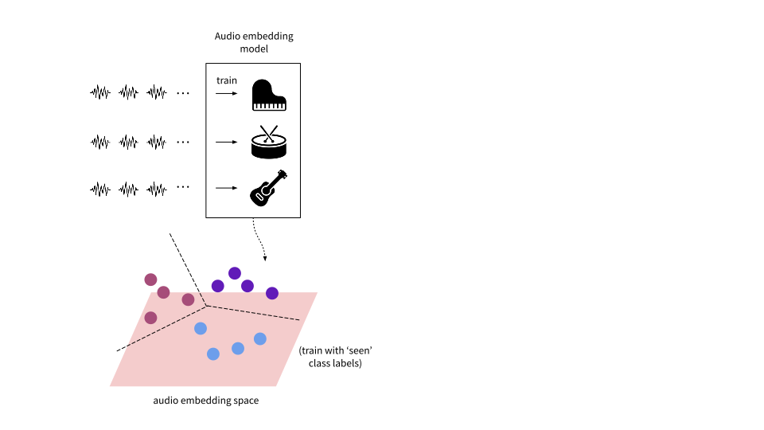

However, there isn't a way to make prediction of unseen labels for unseen audio inputs yet.

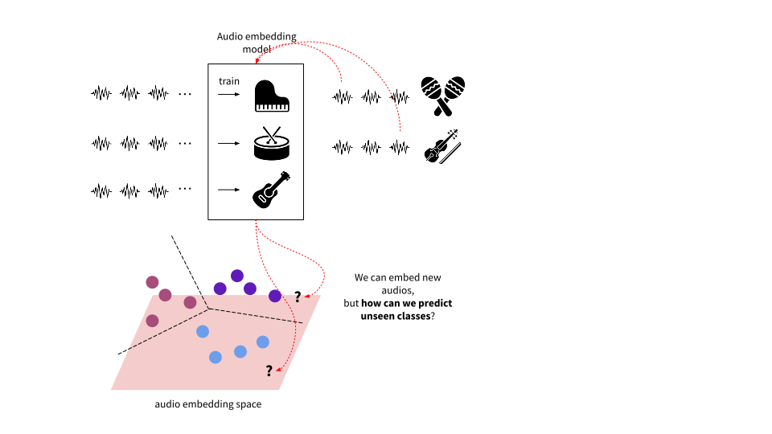

As forementioned we use the side information that can inform the relationships between both seen and unseen labels. 

There are various sources of the side information, such as class-attribute vectors infered from an annotated dataset, or general word embedding vectors trained on a large corpus of documents. 
<!--
We will go over in detail in the later section.  
--->

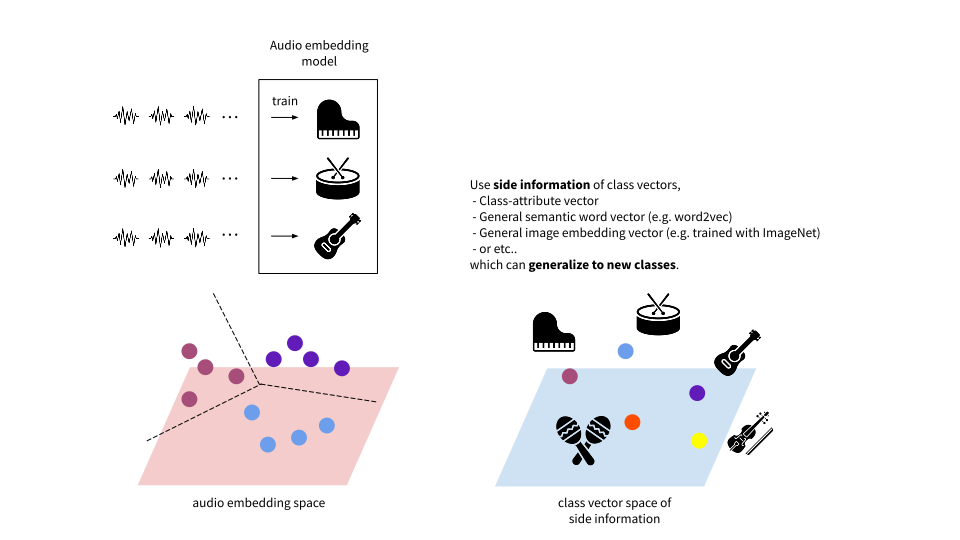

The core of zero-shot learning paradigm is to learn the compatibility function between the embedding space of the inputs and the side information space of their labels. 

- Compatibility function : \(F(x, y ; W)=\theta(x)^T W \phi(y)\)
    - \(\theta(x)\) : input embedding function.
    - \(W\) : mapping function. 
    - \(\phi(y)\) : label embedding function.

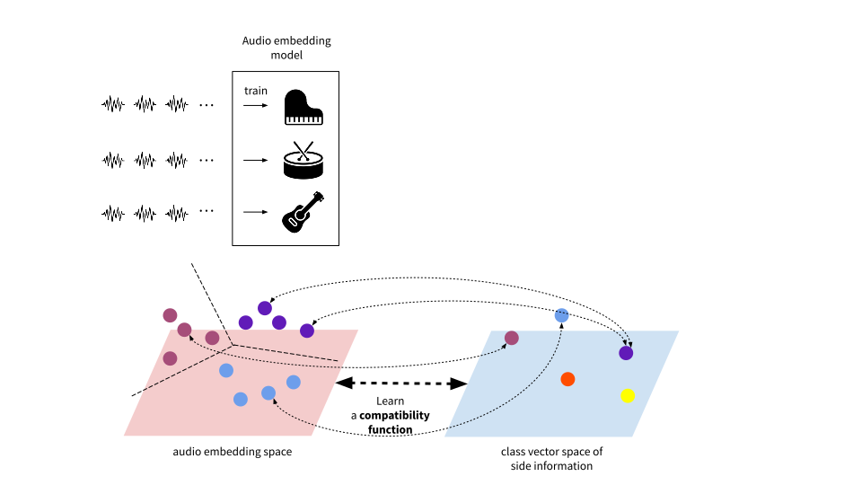

### Learning a mapping function

A typical approach is to train a mapping function between the two.
By unveiling relationship between the side information space and our input feature space, it is possible to map vectors from one space to the other.

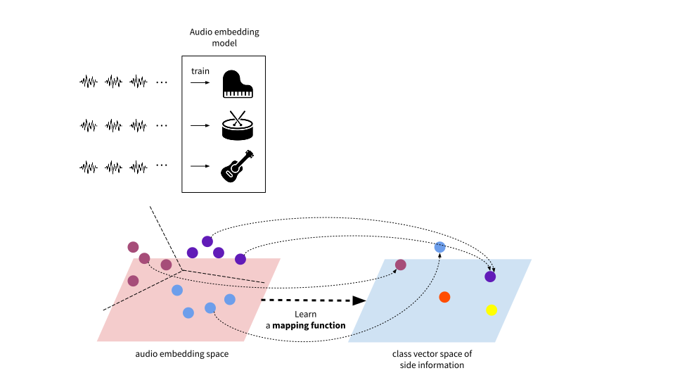

After training, arbitrary inputs of unseen labels can be predicted to the corresponding class. 

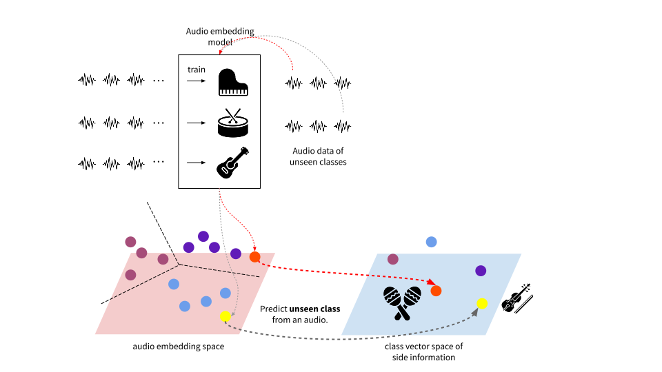

### Metric-learning approach

Another option is to train a separate zero-shot embedding space where the embeddings from both spaces are projected (a metric-learning approach).

- E.g. Training mapping functions \(W_1\) and \(W_2\) with a pairwise loss function : \(\sum_{y \in \mathcal{Y}^{seen}}\left[\Delta\left(y_n, y\right)+F\left(x_n, y ; W_1, W_2\right)-F\left(x_n, y_n ; W_1, W_2\right)\right]_{+}\)
    - where \(F(x, y ; W_1, W_2)= -\text{Distance}(\theta(x)^T W_1, \phi(y)^T W_2)\)

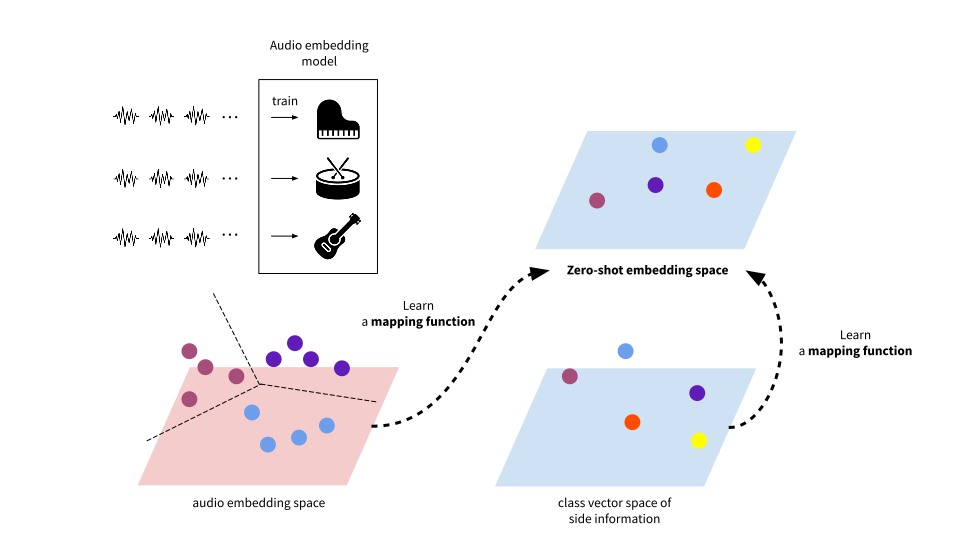

In this case, the inputs and the classes are projected onto another zero-shot embedding space.

This space-aligning technique is one of the main branches of zero-shot learning framework. Next, we'll go over another branch or research direction, the generative approach.  

### Generative approach

One example of the generative approach is to employ a conditional Generative Adversarial Network (GAN) to generate samples related to the unseen classes. Its training process  consists of two parts. 

At the first part of the training phase, with the audio data annotated with the seen classes, we train the GAN architecture (a generator and a discriminator) combined with the audio encoder and an additional classification model. The convolutional neural network (CNN) audio encoder will try to embed the audio into the *CNN feature vectors* that well represents the class characteristics by being evaluated by the discriminator. At the same time, given the class representative vectors we get from the side information space, the generator will try to **mimic** the *CNN audio feature vector* that is produced by the audio encoder. There could be an additional classification module that is aimed to classify the labels from the generated *CNN audio feature vector*. This module helps the regularization of the GAN framework.  

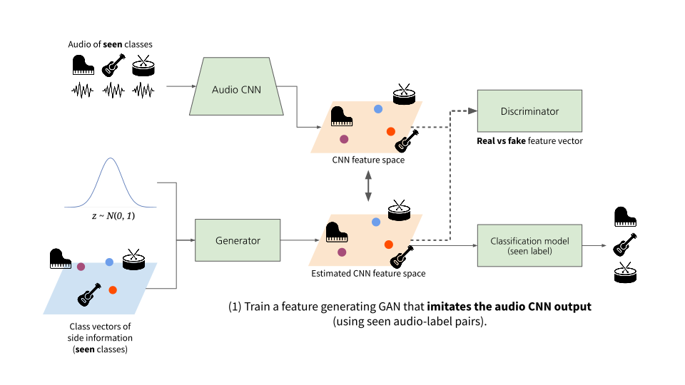

After training the GAN framework, we can now generate the *CNN audio feature vector* of an arbitrary unseen class, given the class representative vector on the side information space. 

With the help of the generative model, we can actually generate as many vector samples we want for a certain class. 

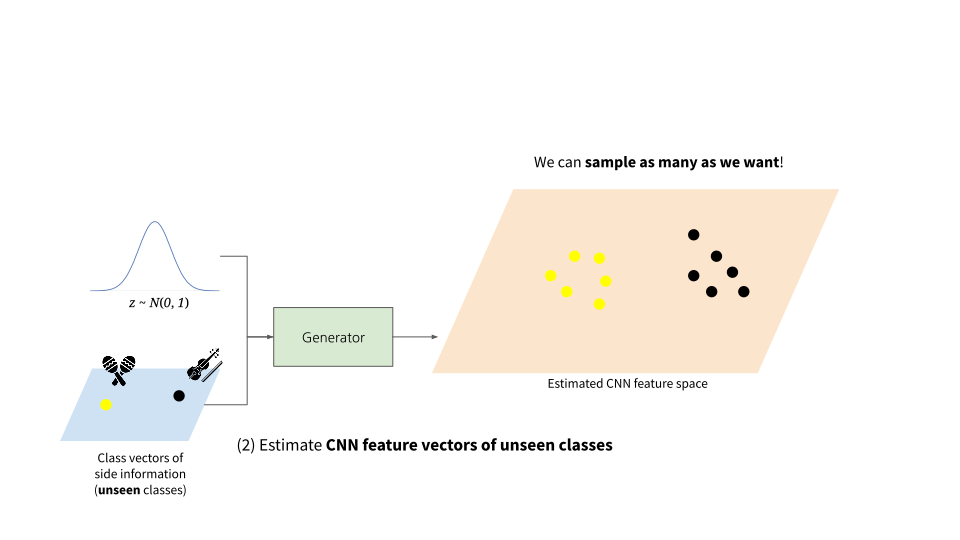

After generating a sufficient number of the *CNN audio feature vector*, we now have a paired dataset (*CNN audio feature vector* / their labels) for training a classifier for the unseen classes. This is the second part of the training phase.

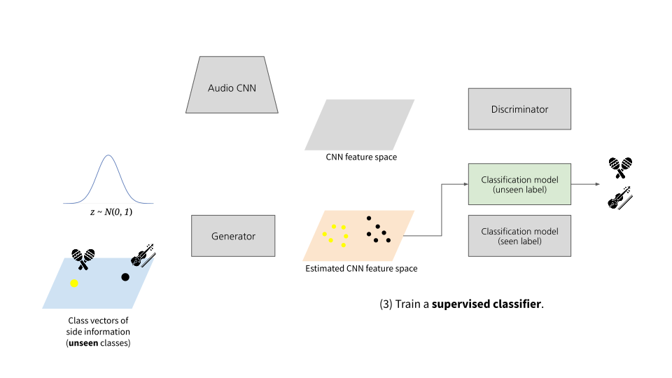

We could also train a classifier in the *generalized* zero-shot evaluation manner. 

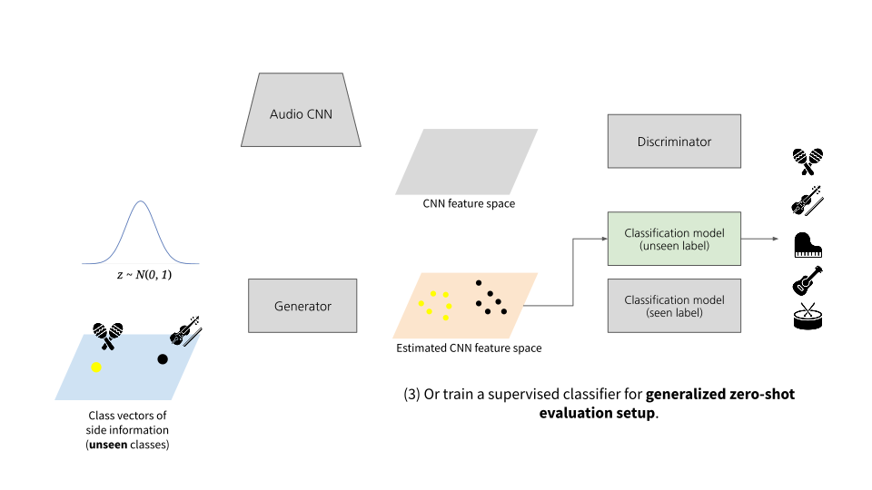

After training, we are now ready with the audio encoder and the classifier. The model can make prediction of unseen classes given the audio input.

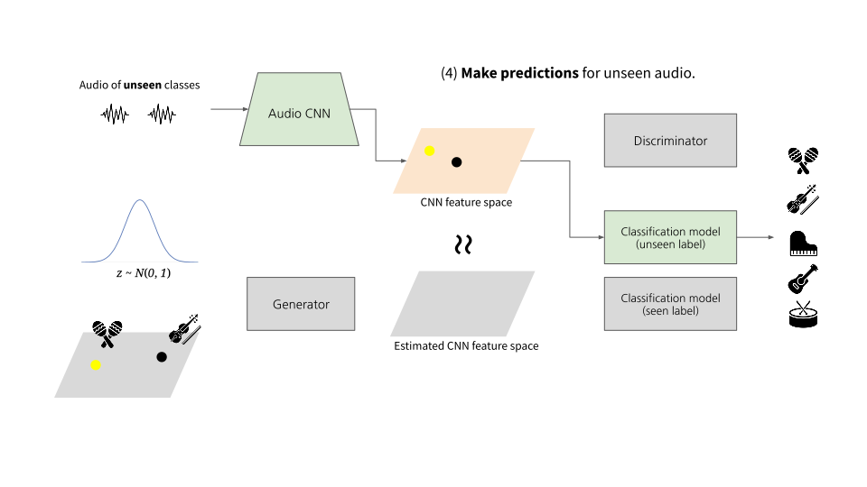

So far, we've gone through the broad concepts of the major zero-shot learning paradigms. 

# Popular Few/Zero Shot learning models

There are also more complex zero/few-shot mainstream alternatives with widespread application in the industry, such as CLIP.

## Contrastive Language-Image Pre-Training (CLIP)

Introduced by OpenAI in 2021, [CLIP](https://openai.com/research/clip) uses an encoder-decoder architecture for **multimodal zero-shot** learning. The illustration below explains how CLIP works.

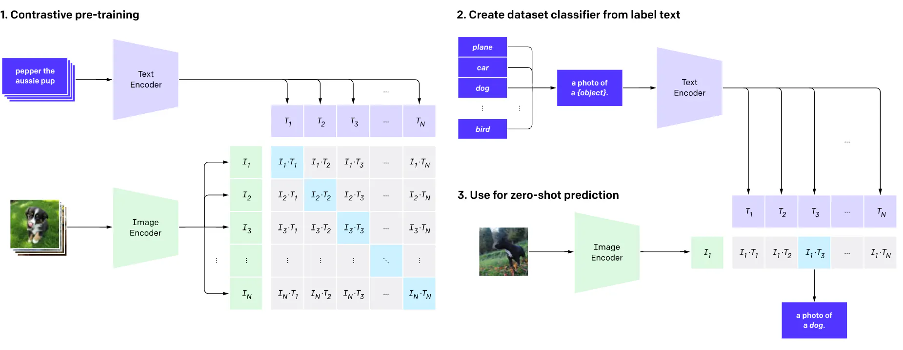

CLIP (Contrastive Language–Image Pre-training) builds on a large body of work on zero-shot transfer, natural language supervision, and multimodal learning. It inputs text snippets into a text encoder (TE) and images into an image encoder (IE). It trains the encoders to predict the correct class by matching images with the appropriate text descriptions.

The IE takes an image, the TE takes text, both of which return vector representations of the input. To match the dimensions of their results, a linear transformation layer is added to both IE and TE. For IE, the authors advise using ResNet or VisionTransformer. For TE, Continuous BOW (CBOW).

For pre-training, 400 million pairs of the form (image, text) are used, which are fed to the input of IE and TE. Then a matrix is ​​considered, the element \((i, j)\) of which is the cosine similarity from the normalized vector representation of the \(i\)-th image and the \(j\)-th textual description. 

Thus, the correct pairs will end up on the main diagonal. Finally, by minimizing the cross-entropy along each vertical and horizontal axis of the resulting matrix, we maximize its values ​​on the main diagonal.

Once CLIP has been trained, you can use it to classify images from any set of classes — simply submit this set of classes, presented as descriptions, to TE, and the image to IE, and see which class represents the cosine similarity of the image with the greatest value.

## OpenAI GPT-3

In 2020, OpenAI announced GPT-3. However, it wasn’t just another size upgrade. The paper, named [_Language Models are Few-Shot Learners_](https://arxiv.org/pdf/2005.14165.pdf), describes a generative language model with 175 billion parameters, 10x more than any previous language model. They published its performance on NLP benchmarks in which GPT-3 showed the improved capability to handle tasks purely via text interaction.

Those tasks include zero-shot, one-shot, and few-shot learning, where the model is given a task definition and/or a few examples and must perform the task without additional training. That is, no fine-tuning is used. It is as though humans perform a new language task from only a few examples of simple instructions. The question posed in the paper is: can a pre-trained language model become a meta-learner?

To answer this, they use in-context learning. Below is a demonstrative diagram of how in-context learning works, where the model develops a broad set of capabilities and learns to adapt them to perform tasks defined via natural language examples.

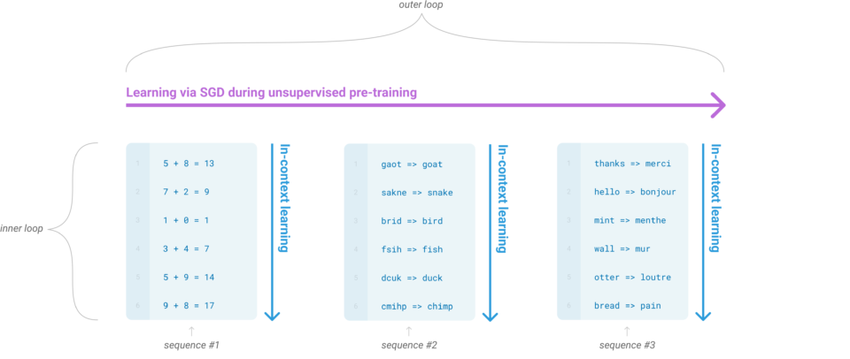

The outer loop refers to the unsupervised pre-training where the model acquires language skills. On the other hand, the inner loop occurs when we feed forward a sequence of examples to the model, which learns the context from the sequence to predict what comes next. It is like a human reading a sequence of examples and thinking about the next instance. As the model uses the language skills learned during the pre-training phase to learn the context given in the sequence, no neural network parameter updates are involved in this learning phase. They call it in-context learning.

The diagram’s first (left-most) example provides a context for performing arithmetic addition. Then, the second (middle) demonstrates how to correct spelling mistakes. The last (right-most) provides examples of English-to-French word translations. Given the respective context, the model must learn how to perform the intended task. They tried this approach with GPT-2, but the result wasn’t good enough to be a practical method of solving language tasks.

Since then, however, they saw a growing trend in the capacity of transformer language models in terms of the number of parameters, bringing improvements to text generation and other downstream NLP tasks. They hypothesized that in-context learning would show similarly substantial gains with scale.

Therefore, OpenAI researchers trained a 175 billion parameter language model (GPT-3) and measured its in-context learning abilities.

### Few-Shot, One-Shot, and Zero-Shot Learning in GPT-3

They evaluated GPT-3 on three conditions:

* Zero-Shot allows no demonstrations and gives only instruction in natural language.
* One-Shot allows only one demonstration.
* Few-Shot (or in-context) learning allows as many demonstrations (typically 10 to 100).

The below diagram explains the three settings (on the left) of GPT-3 evaluations, compared with the traditional fine-tuning (on the right).

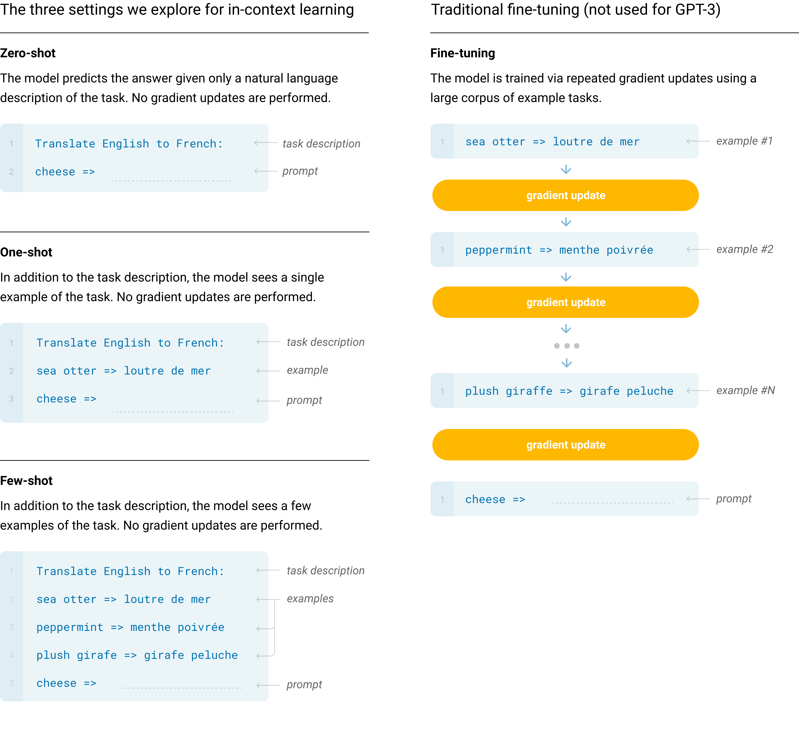

The following graph shows the model performance on the learning task where it needs to remove extraneous (unnecessary) symbols from a word. The model performance improves over the number of in-context examples (\(K\)), with or without a prompt (natural language task description), where \(K = 0\) is zero-shot, \(K = 1\) is one-shot, and \(K > 1\) is few-short learning. It makes sense that the model performs better with a larger K as it can learn from more examples. Moreover, a prompt would give more context, improving the model’s accuracy, especially where \(K\) is smaller. In other words, no prompt means that the model must infer what is being asked (i.e., guess the prompt) from the examples.

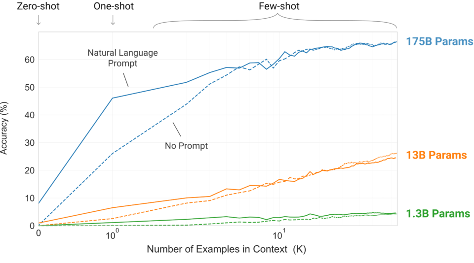

As we can see, the largest model with 175 billion parameters has the steepest improvement, proving that the larger capacity of the model increases the model’s ability to recognize patterns from the in-context examples. Therefore, the main conclusion is that **LLM size Does Matter To In-Context Learning**.

It should be reiterated that the accuracy improvement does not require gradient updates or fine-tuning. The increasing number of demonstrations given as conditioning allows the model to learn more contexts to improve its prediction accuracy.

