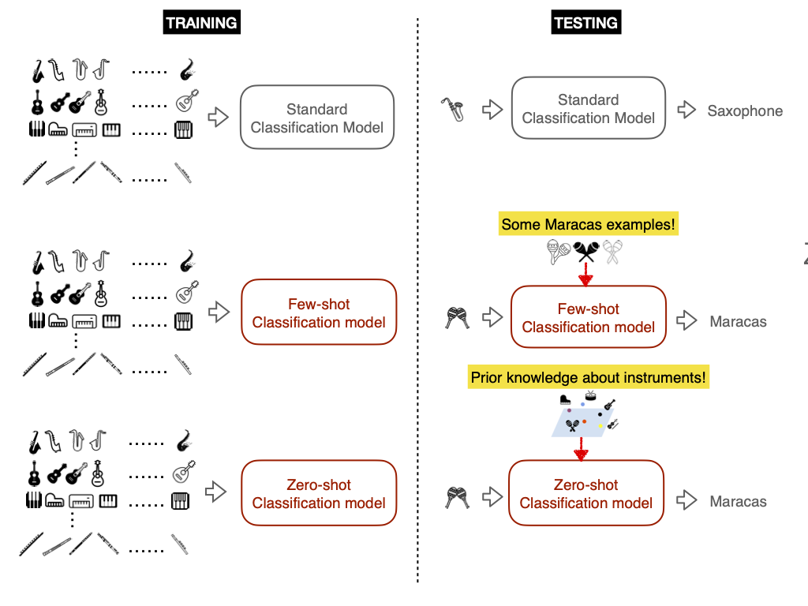
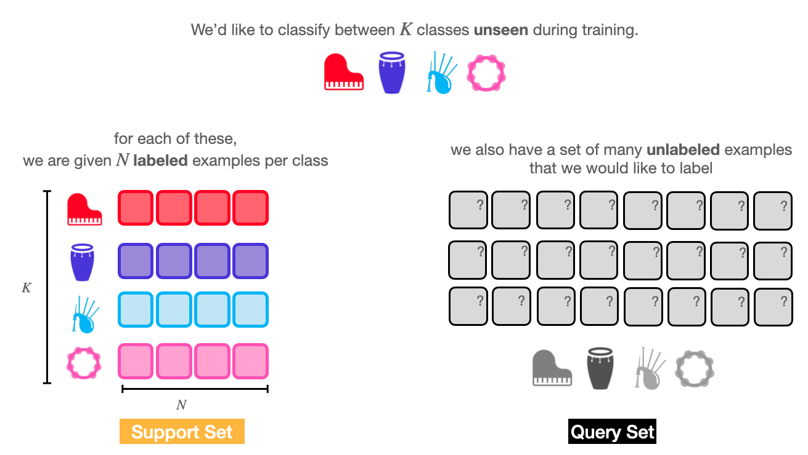
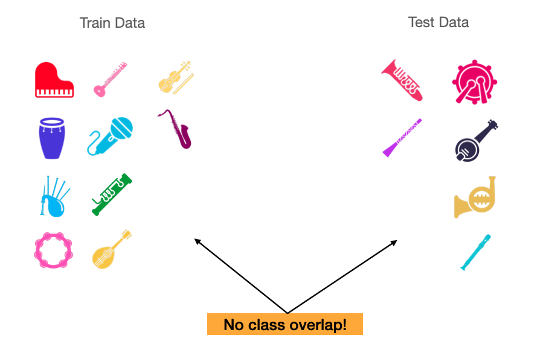
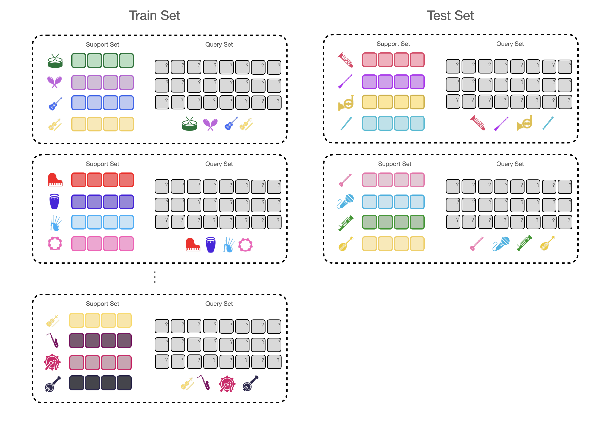

# Few and Zero Shot Learning

!!! danger

    This is work in progress. The contents of this page are not final and, therefore, it is not recommended to start working on its contents yet.

The following contents are copied (and slighly adapted) to the AI master from the [ISMIR 2022 tutorial](https://github.com/music-fsl-zsl/tutorial) created by Yu Wang, Hugo Flores García, and Jeong Choi. This is shared under [Creative Commons BY-NC-SA 4.0](https://github.com/music-fsl-zsl/tutorial/blob/main/LICENSE).

## What is Few-Shot Learning (FSL) and Zero-Shot Learning (ZSL)?

Before we dive right into FSL and ZSL, we would like to start with a brief discussion about the labeled data scarcity problem to illustrate the motivation and relevance of few-shot and zero-shot learning.  

### The Scarcity Issue for Labeled Data in MIR

Deep learning has been highly successful in data-intensive applications, but is often hampered when the dataset is small. A deep model that generalizes well typically needs to be trained on a large amount of labeled data. However, most MIR datasets are small in size compared to datasets in other domains, such as image and text. This is not only because collecting musical data may be riddled with copyright issues, but annotating musical data can also be very costly. The annotation process often requires expert knowledge and takes a long time as we need to listen to audio recordings multiple times. Therefore, many current MIR studies are built upon relatively small datasets with less-than-ideal model generalizability. MIR researchers have been studying strategies to tackle this scarcity issue for labeled data. These strategies can be roughly summarized into two categories:

- **Data**: crowdsourcing {cite}`levy2011`{cite}`cartwright2015`, data augmentation {cite}`mcfee2015`{cite}`Uhlich2017`, data synthesis {cite}`cartwright2018`{cite}`manilow2019cutting`, etc.
- **Learning Paradigm**: transfer learning {cite}`pons2018`, semi-supervised learning {cite}`li2004`{cite}`You2007`, etc.

However, there are different challenges for each of these approaches. For example, crowdsourcing still requires a large amount of human effort with potential label noise, the diversity gain from data augmentation is limited, and models trained on synthetic data might have issues generalizing to real-world audio.
Even with the help of transfer learning or unsupervised learning, we often still need a significant amount of labeled data (e.g. hundreds of thousands of examples) for the target downstream tasks, which could still be hard for rare classes. 

### FSL and ZSL

Few-shot learning (FSL) and zero-shot learning (ZSL), on the other hand, tackle the labeled data scarcity issue from a different angle. They are learning paradigms that aim to learn a model that can learn a new concept (e.g. recognize a new class) quickly, based on just *a handful of labeled examples* (few-shot) or some *side information or metadata* (zero-shot). 

### An example
To have a better idea of how FSL and ZSL differ from standard supervised learning, let's consider an example of training a musical instrument classifier. We assume that there is an existing dataset in which we have abundant labeled examples for common instruments.

- In a standard supervised learning scenario, we train the classification model on the training set `(guitar, piano)`, then at test time, the model classifies *"new examples"* of *"seen classes"* `(guitar, piano)`.
- In a few-shot learning scenario, we also train the model with the same training set that is available `(guitar, piano)`. But at test time, the goal is for the few-shot model to recognize *"new examples"* from *"unseen classes"* (like `(banjo, kazoo)`) by providing a very small amount of labeled examples.  
- In a zero-shot learning scenario, we train the model on the available training set `(guitar, piano)`. But at test time, the goal is for the zero-shot model to recognize *"new examples"* from *"unseen classes"* (like `(banjo, kazoo)`) by providing some side information or metadata (e.g. the instrument family, e.g. string, wind, percussion, etc.) or a text embedding.

# Few-Shot Learning Foundations

It should come with no surprise that data is at the core of few-shot learning problems. This chapter covers the foundations of few-shot learning – namely how we think about and structure our data – when trying to learn novel, unseen classes with very little labeled data.

When solving traditional classification problems, we typically consider a closed set of classes. That is, we expect to see the same set of classes during inference as we did during training. Few-shot learning breaks that assumption and instead expects that the classification model will encounter novel classes during inference. There is one caveat: there are a **few labeled examples** for each novel class at inference time. 

In few-shot learning, we expect to see **novel** classes at inference time. We also expect to see a few labeled examples (a.k.a. "shots") for each of the novel classes. 

> Transfer learning and data augmentation are often considered approaches to few-shot learning  {cite}`song2022comprehensive`, since both of these approaches are used to learn new tasks with limited data. 
However, we believe these approaches are extensive and deserve their own treatment, and so we will not cover them here.
Instead, we will focus on the topic of **meta-learning** – or learning to learn – which is at the heart of recent advances for few-shot learning in MIR {cite}`wang2020fewshotdrum,flores2021leveraging,wang2022fewshot`. Transfer learning and data augmentation are orthogonal to meta-learning and can be used in conjunction with meta-learning approaches.

## Defining the Problem

Consider that we would like to classify between $K$ classes, and we have exactly $N$ labeled examples for each of those classes. 
We say that few-shot models are trained to solve a $K$-way, $N$-Shot classification task. 

A few-shot learning problem splits data into two separate sets: the support set (the few labeled examples of novel data) and the query set (the data we want to label).

Few shot learning tasks divide the few labeled data we have and the many unlabeled data we would like to to label into two separate subsets: the **support set** and the **query set**. 

The small set of labeled examples we are given at inference time is the **support set**. The support set is small in size and contains a few ($N$) examples for each of the classes we would like to consider. The purpose of the support set is to provide some form of guidance to help the model learn and adapt to the novel classification task. 

Formally, we define the support set as a set of labeled training pairs $S = \{(x_1, y_1,), (x_2, y_2), ..., (x_N, y_N)\}$, where:

- $x_i \in \mathbb{R}^D$ is a $D$-dimensional input vector.
- $y_i \in \{1,...,C\}$ is the class label that corresponds to $x_i$.
- $S_k$ refers to the set of examples with label $K$.
- $N$ is the size of the support set, where $N = C \times K$.  

On the other hand, the query set – typically denoted as $Q$ – contains all of the examples we would like to label. We can compare the model's predictions on the query set to the true labels (i.e., ground truth) to compute the loss used for training the model. In evaluation, we can use these predictions to compute metrics such as accuracy, precision, and recall.

### The Goal

The goal of few-shot learning algorithms is to learn a classification model $f_\theta$ that is able to generalize to a set of $K$ previously unseen classes at inference time, with a small support set of $N$ examples for each previously unseen class.

## Meta Learning -- Learning to Learn

In order for a classifier to be able to learn a novel class with only a few labeled examples, we can employ a technique known as **meta learning**, or learning to learn.

> Even though our goal in few shot learning is to be able to learn novel classes with very few labeled examples, we *still* require a sizable training dataset with thousands of examples. The idea is that we can *learn how to learn new classes* from this large training set, and then apply that knowledge to learn novel classes with very few labeled examples.

### Class-conditional splits

In supervised learning, one typically creates a train/test split in the dataset while ensuring that the classes seen during training are the same as those seen during testing.

In few-shot learning, because we'd like our model to generalize to novel classes at inference time, we must make sure that there is no overlap between classes in our train, and test sets.

A train/test split with no overlap between classes is called a **class-conditional** split. 

### Episodic Training

To take full advantage of a large training set for few-shot learning, we use a technique referred to as **episodic training** {cite}`vinyals2016matching, ravi2017optimization`. 

> Episodic training is an efficient way of leveraging a large training dataset to train a few-shot learning model.

Episodic training aims to split each training iteration into it's own self-contained learning task. An episode is like a simulation of a few-shot learning scenario, typically with $K$ classes and $N$ labeled examples for each class -- similar to what we expect the model to be able to infer at inference time. 

During episodic training, our model will see a completely new $N$-shot, $K$-way classification task at each step. To build a single episode, we must sample a completely new support set and query set during each training step. 

Practically, this means that for each episode, we have to choose a subset of $K$ classes from our training dataset and then sample $N$ labeled examples (for the support set) and $q$ examples (for the query set) for each class that we randomly sampled. 

## Evaluating a Few-Shot Model
Validation and Evaluation during episodic training can be done in a similar fashion to training. We can build a series of episodes from our validation and evaluation datasets, and then evaluate the model on each episode using standard classifcation metrics, like [precision, accuracy, F-score,](https://developers.google.com/machine-learning/crash-course/classification/precision-and-recall) and [AUC](https://developers.google.com/machine-learning/crash-course/classification/roc-and-auc). 

We've now covered the basic foundations of few-shot learning. In the next chapter, we'll look at some of the most common approaches to few-shot learning, namely **metric**-based, **optimization**-based, and **memory**-based approaches. 

